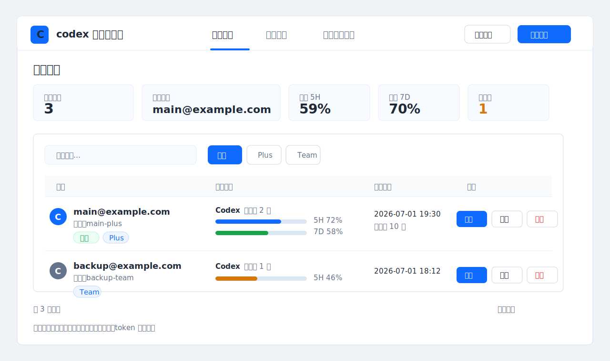

# Codex Account Manager

> Windows 本地优先的 Codex 账号管理辅助工具。
> 面向个人电脑场景，提供登录备份、手动切换、账号备注、额度查看等能力。


## 小白先看

如果你只是想把软件用起来，不需要先学 GitHub，也不需要自己编译。

普通用户建议使用已经打包好的 Windows 压缩包：

1. 解压整个文件夹
2. 双击 `Start.bat`
3. 按界面里的按钮导入、切换、备注、刷新额度

GitHub 这个仓库主要给两类人看：

- 想确认工具逻辑是否干净的人
- 想二次修改、学习或自己打包的开发者

如果你不是开发者，不建议直接下载源码后硬部署。源码版缺少完整的 Windows 打包外壳，直接跑起来可能会比压缩包版本麻烦。

## 让 Codex 帮你部署

把 Windows 压缩包发给 Codex，然后直接丢这句：

```text
根据我的电脑环境，帮我把这个 Codex 账号管理器压缩包部署到本地，让它能正常运行，并在桌面创建快捷方式。不要改源码，不要移动我的账号数据；缺什么环境就帮我补齐并说明结果。
```

简单流程：


## 界面预览



## 项目定位

Codex Account Manager 是一个偏“个人自用”的本地管理工具。

它不是自动账号池，也不是无缝轮换器，更不是代理、反代或绕过官方限制的工具。它解决的是一个更朴素的问题：

> 当你在自己的 Windows 电脑上管理多个 Codex 登录状态时，不想反复手动找 `auth.json`、复制、备份、覆盖和记录备注。

本项目把这些容易出错的手动步骤收进一个本地面板里，让导入、切换、备注、刷新额度这些操作变得更清楚、更可控。

## 核心特性

- **本地优先**：账号备份、备注和运行数据默认保存在本机 `data/` 目录。
- **手动切换**：只在用户明确点击后切换账号，不做后台静默轮换。
- **账号备份**：保存已导入过的 Codex 登录状态，减少手动管理文件的麻烦。
- **账号备注**：为不同邮箱记录本地备注，方便区分用途、线索和状态。
- **额度查看**：支持手动刷新 5H / 7D 额度，并显示可重置次数。
- **异常提示**：当账号登录状态失效时，提示重新登录并更新本地凭证。
- **轻量界面**：Web UI + 本地脚本，适合 Windows 免安装压缩包形态。

## 和自动切换工具的区别

一些工具更偏自动化、无缝切换或规则调度，适合熟悉配置、环境变量和自动化风险的用户。

本项目走的是另一条路线：

- 不自动乱切账号
- 不低额度自动换号
- 不并发调度账号池
- 不碰代理或反向代理
- 不把本地账号数据上传到远程服务器
- 所有关键操作尽量保持可见、手动、可确认

如果你需要的是高度自动化调度，本项目可能不是最适合的选择。
如果你只是想把自己电脑上的几个 Codex 登录状态管清楚，本项目会更合适。

## 适用场景

- 自己电脑上使用过多个 Codex 登录状态
- 不想手动复制、覆盖 `.codex/auth.json`
- 想给每个账号保存本地备注
- 想手动查看额度和重置次数
- 希望工具行为简单、低频、可控

## 不适用场景

本项目不提供，也不建议用于以下用途：

- 购买、出售或分发账号
- 提供会员、额度或订阅服务
- 破解、绕过或规避官方限制
- 自动账号池、自动轮换、批量并发
- 代理、反代、流量转发
- 将账号凭证上传到第三方服务

## 仓库内容

本仓库是公开源码版，主要包含：

```text
.
├─ webui/                         # 前端界面
├─ advanced/                      # 高级辅助入口脚本
├─ codex-shim/CodeShim.cs         # Codex 启动辅助源码
├─ data/.gitkeep                  # 空数据目录占位
├─ Start.bat                      # Windows 启动入口
├─ start-cas-safe.cmd             # 安全启动脚本
├─ Start-CAS-Metadata-Server.ps1  # 本地元数据服务
├─ Sync-Current-Codex-To-CAS.ps1  # 当前 Codex 登录状态同步脚本
├─ Prepare-Codex-New-Login.ps1    # 准备登录新账号
├─ README-Windows.txt             # Windows 简要说明
├─ LICENSE
└─ README.md
```

## 没有包含的内容

为了避免误传隐私，本仓库不会包含：

- 真实 `auth.json`
- 账号备份
- 账号备注
- token、邮箱备注、登录缓存
- 日志、pid、临时文件
- WebView2 用户数据
- Windows 二进制发布包
- `.exe`、`.dll`、`.zip` 等构建产物

公开目录由生成脚本整理而来，并配有 `.gitignore` 防止常见敏感文件被误提交。

## 数据与隐私

工具默认把运行数据写入本地 `data/` 目录。

典型数据包括：

- 账号备份索引
- 本地备注
- 首次导入时间缓存
- 额度刷新缓存
- 本地日志和运行状态

这些数据属于用户本机数据，不应该提交到 GitHub，也不应该随意发给别人。

## 开发者快速开始

> 注意：当前公开仓库不包含完整 Windows 二进制外壳。
> 如果你是普通用户，建议使用已经打包好的 Windows 压缩包。
> 如果你是开发者，可以基于本仓库查看界面和脚本逻辑。

Windows 用户的典型入口：

```bat
Start.bat
```

核心账号路径：

```text
%USERPROFILE%\.codex\auth.json
```

工具会围绕这个本地登录文件进行备份、导入和切换。

## 安全边界

本项目刻意保持以下边界：

- 只做本地文件管理
- 只做用户可见的手动操作
- 不做后台自动轮换
- 不做远程账号托管
- 不读取浏览器 Cookie
- 不提供账号或额度
- 不承诺规避任何平台检测或限制

## 开发说明

公开源码目录由主工作目录生成：

```powershell
powershell -NoProfile -ExecutionPolicy Bypass -File .\Build-GitHubPublic.ps1
```

生成脚本会排除私有数据、缓存、日志和发布包，只保留适合公开的源码与说明文件。

## 路线想法

- 完善公开源码构建说明
- 拆分 Windows 外壳与 Web UI 的边界
- 提供更清晰的开发者启动方式
- 增加更多本地安全检查
- 改进首次导入时间、额度缓存等状态管理

## 免责声明

本项目不是 OpenAI 官方项目，也不与 OpenAI 存在从属关系。

Codex、OpenAI 登录流程、接口结构和本地文件行为可能随时间变化。本项目提供的是本地辅助管理思路和实现参考，不保证任何第三方服务长期稳定可用。

使用者应自行遵守相关服务条款，并自行承担使用风险。

## License

MIT License
